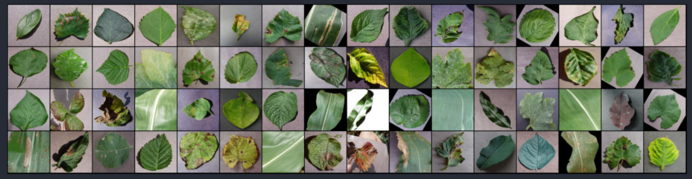
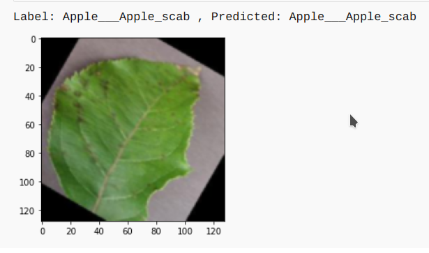
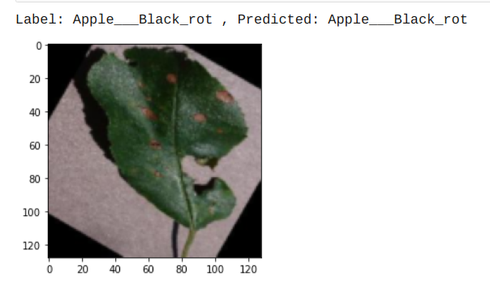

# 🌱 PLANT-AI  
### Recognition of Plant Diseases by Leaf Image Classification  

**Created by Lingaraj | RAJ CREATES | RAJ MANIA**

---

## 🔎 Overview  

Ensuring food security for billions requires minimizing crop losses through **early disease detection**. Traditional methods—manual inspection by farmers or experts—are slow, expensive, and impractical for millions of small and medium farms worldwide.  

This project introduces a **deep learning-based solution** for plant disease recognition using **leaf image classification**. By leveraging convolutional neural networks (CNNs) and transfer learning, the model can detect **38 diseases across 14 plant species**, while effectively separating leaves from their surroundings.  

---

## 🖼️ Leaf Image Classification  

The workflow for building the model:  

1. **Dataset Collection**  
   - Used [New Plant Diseases Dataset](https://www.kaggle.com/vipoooool/new-plant-diseases-dataset).  
   - Contains thousands of healthy and diseased crop leaf images.  

2. **Model Development**  
   - Framework: **PyTorch**  
   - Architectures explored:  
     - Custom CNN (Conv layers + MaxPooling + Fully Connected layers)  
     - Transfer Learning with **VGG16**  
     - Transfer Learning with **ResNet34**  

3. **Training**  
   - Hyperparameters and architecture variations tested.  
   - Best performing model achieved **98.42% test accuracy**.  

4. **Evaluation**  
   - Tested on **17,572 images** across **38 classes**.  
   - Example predictions:  
   

   
   
   
  

5. **Comparisons**  
   - Tried multiple optimizers & learning rates.  
   - Performance summary shown below:  
   

---

## 📊 Model Capabilities  

- Detects **38 diseases**  
- Covers **14 unique plants**  
- [Complete list here](Src)  

---

## 🚀 Future Enhancements  

- **Image Localization** → Identify exact infected area on the leaf.  
- **Recommender System** → Suggest pesticides & treatment strategies.  
- **Crop Management Integration** → Early detection + management strategies to boost productivity.  

---

## 🛠️ Usage  

- `Flask` → Deployment server  
- `TestImages` → Sample input images  
- `Src` → Source code (training & evaluation scripts)  
- `Models` → Pretrained PyTorch models  

---

## 👤 Author  

- **Name:** Lingaraj  
- **Email:** rajlingaraj2002@gmail.com  

---
